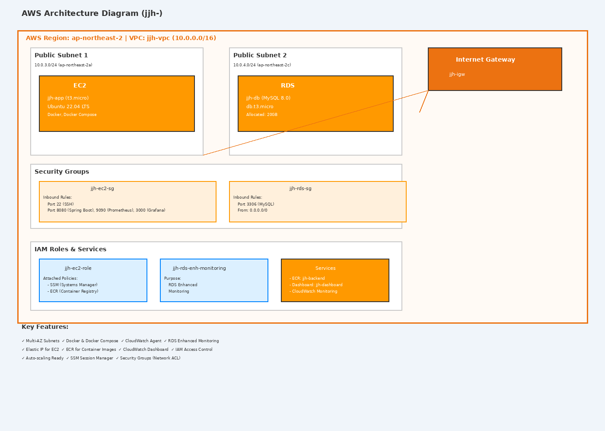

# 🚀 AWS Automated Infrastructure with Terraform



이 프로젝트는 **Terraform**을 사용하여 AWS 클라우드에 확장 가능하고 모니터링 가능한 인프라를 자동으로 구축하는 코드(IaC)입니다. 
개발자가 애플리케이션 개발에만 집중할 수 있도록 VPC, EC2(Docker 환경), RDS, ECR, 그리고 실시간 대시보드까지 한 번에 구성합니다.

---
## ✨ 주요 기능 및 특징 (Key Features)

### 1. 인프라 자동화 (Infrastructure as Code)
* **Terraform**을 사용하여 수동 조작 없이 AWS 인프라 전체(네트워크, 서버, DB, 보안)를 일관성 있게 생성하고 관리합니다.
* 코드 기반 관리를 통해 인프라의 변경 이력을 추적하고 빠르게 재구축할 수 있습니다.

### 2. 자동화된 서버 프로비저닝 (Automated Provisioning)
* **User Data** 스크립트를 활용해 EC2 인스턴스 생성 즉시 다음 환경을 자동 구성합니다:
  * **Docker & Docker-Compose:** 컨테이너 기반 애플리케이션 실행 환경.
  * **AWS CLI v2:** 클라우드 리소스 관리를 위한 도구.
  * **Amazon SSM Agent:** 보안을 강화한 원격 서버 관리.
  * **CloudWatch Agent:** 상세 메트릭 수집을 위한 에이전트.

### 3. 고가용성 네트워크 및 보안 설계
* **VPC & Multi-AZ:** 2개의 가용 영역(AZ)을 활용한 네트워크 설계로 가용성을 높였습니다.
* **IAM Role:** 최소 권한 원칙(Least Privilege)을 적용하여 EC2가 안전하게 ECR 및 CloudWatch와 통신합니다.
* **보안 그룹(Security Group):** 용도별(EC2, RDS) 보안 그룹 분리 및 포트 제어.

### 4. 통합 관제 대시보드 (Monitoring)
* **CloudWatch Dashboard:** 별도의 설정 없이도 EC2의 메모리/CPU 사용률과 RDS의 상태를 시각적으로 확인할 수 있는 통합 대시보드를 제공합니다.

---

## 🛠 기술 스택 (Tech Stack)

| 구분 | 기술 | 상세 내용 |
| :--- | :--- | :--- |
| **Cloud** | **AWS** | VPC, EC2, RDS, ECR, CloudWatch, IAM |
| **IaC** | **Terraform** | 인프라 자원 자동 생성 및 상태 관리 |
| **Container** | **Docker** | 애플리케이션 컨테이너화 및 Docker-Compose 관리 |
| **OS** | **Ubuntu** | Ubuntu 24.04 LTS 최신 운영체제 활용 |
| **Database** | **MySQL** | RDS for MySQL 8.0 기반 관리형 DB |

---

## 🚀 실행 가이드 (Getting Started)

### 1. 사전 준비 (Prerequisites)
* **AWS CLI:** 로컬 환경에 설치 및 자격 증명(`aws configure`) 완료.
* **Terraform:** 로컬 환경에 설치 완료.
* **SSH Key:** 공개키 파일(`jjh-key.pub`)이 프로젝트 루트 폴더에 위치해야 합니다.

### 2. 설치 및 실행

```bash
# 프로젝트 복제 (또는 폴더 이동)
cd [프로젝트-폴더-이름]

# 1. 테라폼 초기화 (플러그인 설치)
terraform init

# 2. 실행 계획 확인 (변경 사항 검토)
- db_password는 변수로 입력받거나 terraform.tfvars 파일에 정의하세요.
terraform plan -var="db_password=your_secure_password"

# 3. 인프라 구축 실행
terraform apply -var="db_password=your_secure_password" -auto-approve
```

---


## 🏗 시스템 아키텍처


---

## 🛑 트러블슈팅 (Troubleshooting)

프로젝트를 진행하며 발생할 수 있는 일반적인 문제와 해결 방법을 공유합니다.

### 1. Terraform 권한 문제 (Permission Denied)
*   **Issue:** `terraform plan` 또는 `terraform apply` 실행 시 "Access Denied" 또는 "UnauthorizedOperation" 에러 발생.
*   **Cause:** AWS CLI를 통해 설정된 사용자 또는 역할에 Terraform이 생성하려는 리소스에 대한 권한이 없습니다.
*   **Solution:** AWS IAM 콘솔에서 현재 사용하고 있는 IAM User 또는 Role에 필요한 권한(예: `AdministratorAccess` 또는 필요한 서비스별 권한)을 부여합니다. 최소 권한의 원칙에 따라 필요한 권한만 부여하는 것이 좋습니다.

### 2. SSH 접속 문제 (SSH Connection Timed Out)
*   **Issue:** EC2 인스턴스에 SSH 접속 시 "Connection timed out" 에러 발생.
*   **Cause:**
    *   EC2 인스턴스의 보안 그룹 인바운드 규칙에 SSH(22번 포트) 허용이 안 되어 있습니다.
    *   로컬 환경의 IP 주소가 보안 그룹에 등록되어 있지 않습니다.
    *   `jjh-key.pem` 키 페어 파일의 권한이 너무 개방적입니다.
*   **Solution:**
    *   EC2 인스턴스에 연결된 보안 그룹의 인바운드 규칙에 22번 포트(SSH)가 허용되어 있는지 확인합니다.
    *   보안 그룹 규칙에 로컬 환경의 Public IP가 등록되어 있는지 확인합니다. (또는 테스트 목적으로 `0.0.0.0/0`으로 임시 설정)
    *   키 페어 파일(`jjh-key.pem`)의 권한을 `chmod 400 jjh-key.pem`으로 변경합니다.

---

## 📤 출력 값 (Outputs)

`terraform apply` 완료 후 다음 정보들을 확인할 수 있습니다:

*   `public_ip`: 배포된 EC2 인스턴스의 Public IP 주소.
*   `ssh_command`: EC2 인스턴스에 접속하기 위한 SSH 명령어 예시.
*   `instance_id`: EC2 인스턴스의 ID.
*   `ecr_repository_url`: ECR 레포지토리 URL.
*   `rds_endpoint`: RDS MySQL 데이터베이스의 엔드포인트.


